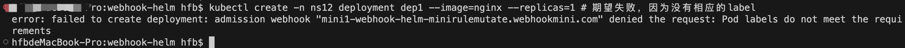
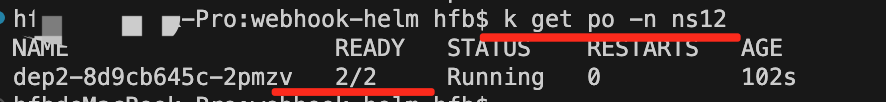
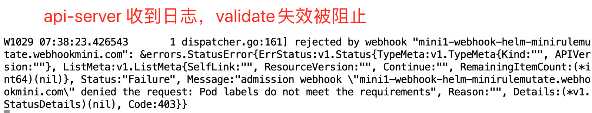

## 部署-步骤1：增加helm仓库并下载
1. helm repo add webhook-helm https://hfbhfb.github.io/webhook-helm
2. helm search repo webhook-helm -l
3. helm pull webhook-helm/webhook-helm-mini  --untar --version 0.1.0

#### 部署-步骤2：部署helm实例

1. helmAppName=mini1
2. Space=webhookmini
3. kubectl create ns ${Space}
4. touch values.yaml
5. helm install webhook-helm-mini/ --namespace  ${Space} --values ./values.yaml --name-template ${helmAppName} 
>- 最终会生成一个secret，存储证书信息
>- ValidatingWebhookConfiguration,MutatingWebhookConfiguration 这两个资源会注入ca相关证书

#### 部署-步骤3：测试
1. kubectl delete ns ns12; kubectl create ns ns12; kubectl label namespace ns12 webhook-mini=enabled; # 准备命名空间
2. kubectl create -n ns12 deployment dep1 --image=nginx --replicas=1 # 期望失败，因为没有相应的label
3. kubectl apply -f dep2.yaml **#项目下这个  dep2.yaml 是满足条件，期望是可成功部署的**

#### 部署-步骤4：清理数据
helm uninstall --namespace  ${Space} ${helmAppName} 

---

## 目录及文件说明

1. 根目录下
>- Makefile # 组织依赖关系： 编译bin-》制作镜像-》部署k8s yaml -》启动应用
>- dep2.yaml # 测试验证用yaml

2. webhook-helm-mini目录
>- main.go # 代码入口和 webhook validate 处理逻辑
>- mutate.go # webhook mutate 处理逻辑
>- Makefile # make文件，编译入口
>- Dockerfile # 镜像制作

3. template-out-mini1目录 # helm template输出的文件，可以看到真正部署到的内容

4. code-webhook-mini目录
>- main.go # 代码入口和 webhook validate 处理逻辑
>- mutate.go # webhook mutate 处理逻辑
>- Makefile # make文件，编译入口
>- Dockerfile # 镜像制作

---

## 效果示例

